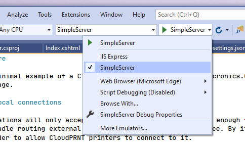

# Simple Server for ASP.Net Core

This project provides a very minimal example of a CloudPRNT server, using the [StarMicronics.CloudPRNT-Utility](https://star-m.jp/products/s_print/CloudPRNTSDK/Documentation/en/api/index.html) package, and implemented with ASP.Net Core using Endpoint Routing and a single Razor Page.

## General Information

- This example is intended to handle connections from a single CloudPRNT compatible printer, and uses a simple static class to hold details about that printer as well as any pending print job.
- A single print job can be queued at a time, which uses that [Star Document Markup](https://star-m.jp/products/s_print/CloudPRNTSDK/Documentation/en/articles/markup/markupintro.html) language.
- The [StarMicronics.CloudPRNT-Utility](https://star-m.jp/products/s_print/CloudPRNTSDK/Documentation/en/api/index.html) package is used to provide serialisation/de-serialization of CloudPRNT messages, handling  the job format negotiation and converting Star Document Markdown into the preferred printer command language.
- This samples is developed and tested using ASP.Net Core 3.1 LTS

## How To Run - Enabling non local connections

Typically, ASP.Net core applications will only accept localhost connections. This is enough for debugging a typical web application, and in production they are often hosted behind a reverse proxy to handle routing external connections into the local service. By it's nature, a CloudPRNT server must accept external connections even during development/debugging, in order to allow CloudPRNT printers to connect to it.

- few steps are required to ensure that external connections are possible:
- in `Program.cs` we have added `.UseUrls(new string[] {"http://*:5000" })` to the web host settings, to enable listening for connections on all interfaces.
- When debugging, ensure that you use the Kestrel web server and not IIS Express (which is the default in Visual Studio):
  
- Ensure that your firewall will allow external connections, by default this example listens on port 5000.

When running, configure your CloudPRNT printer to use `http://<server IP>:5000/cloudprnt` as it's CloudPRNT URL, where `<server IP>` is the IP address of the computer that you are running the sample on.'

## Using the sample server

Once running, open the single page with any web browser, by visiting `http://<Server IP>:5000/`. If your printer has already connected, then you will will see information about your printer. This page is implemented with a basic Razor page in `Pages/index.cshtml`.
Click "Refresh" to reload the page, and view any updated printer information, and click "Print Markup" to create a simple print job. When a printing is requested, then the next time your printer connects it will be converted to the correct command language and printed.

## About the code

### Startup.cs

This is mainly the boilerplate code created by Visual Studio. In addition, it enables Razor page support and registers some endpoints.
```csharp
public void Configure(IApplicationBuilder app, IWebHostEnvironment env)
{
    if (env.IsDevelopment())
    {
        app.UseDeveloperExceptionPage();
    }

    app.UseRouting();

    app.UseEndpoints(endpoints =>
    {
        endpoints.MapRazorPages();

        endpoints.MapGet("/print", CloudPrntEndpointLogic.PrintSomething);

        // Map the CloudPRNT endpoints
        endpoints.MapPost("/cloudprnt", CloudPrntEndpointLogic.CloudPRNT_Poll);
        endpoints.MapGet("/cloudprnt", CloudPrntEndpointLogic.CloudPRNT_FetchPrintJob);
        endpoints.MapDelete("/cloudprnt", CloudPrntEndpointLogic.CloudPRNT_ClearJob);
    });
}
```

Just three endpoints are required to implement a CloudPRNT service, it is necessary to handle POST, GET and DELETE requests to the CloudPRNT URL that your printer(s) will be using, in this case on `/cloudprnt`. Also a single `/print` GET endpoint is registered which simply triggers a print job.


### CloudPrntEndpointLogic.cs

All of the logic is handled in this single file. The CloudPRNT protocol is implemented in the three static methods `CloudPRNT_Poll(HttpContext context)`, `CloudPRNT_FetchPrintJob(HttpContext context)` and `CloudPRNT_ClearJob(HttpContext context)`.

#### CloudPRNT_Poll(HttpContext context)

This is called whenever a print issues a POST to the server. It handles receiving printer status updates and client action responses, as well as informing the printer when printing is required and in what data formats the print job can be provided.

Useful points to note:
- De-serialization of the printer JSON request is done with the `StarMicronics.CloudPrnt.CpMessage.PollRequest.FromJson(string)` instead of using common APIs like `System.Text.Json` of `Newtonsoft.Json`. This simplifies your code by automatically parsing structures like the ClientAction requests that are not of a fixed type. For the same reason, Serialization of the response is done with `StarMicronics.CloudPrnt.CpMessage.PollResponse.ToJson()`.
- As an example of sending and receiving client action requests, Paper size information is requested using the PageInfo client action. This information is important for printing Markup based documents correctly on printer models with differing print widths.
- When indicating to the printer that there is a print job ready to print. The Star CloudPRNT SDK is used to populate the `mediaTypes` response field. This ensures that all supported printer models will work.

#### CloudPRNT_FetchPrintJob(HttpContext context)

When the server has indicated to the printer that there is a job to be printed. The printer will make a GET request to the server, on the same URL to retrieve the print job data. This method demonstrates reading the printer MAC address (used for identifying the device when multiple printers are connected to your service) and requested print job format.

A ConversionOptions object is created to pass in the correct page width information to enable scaling and word-wrapping to function correctly. Then, the static `StarMicronocs.CloudPrnt.Document.Convert()` method is used to convert the source markup data to the printers requested format.

#### CloudPRNT_ClearJob(HttpContext context)

After printing a job, of determining that a job can not be printed for some reason, the printer will send a DELETE request to the server, which is intended to remove the job from the queue. In this case, that is done simply by setting the static byte[] array used to hold pending print job data to null.

#### PrintSomething(HttpContext context)

This method handles the `/print` endpoint to create a print job and then redirect back to the main page at `/`. If creates a Markup based print job, simply by storing the job in a local static byte[] and writing the print job format into an accompanying static string. Markup data is created as a string, but converted to a UTB-8 encoded byte array, which is recommended. UTF-16 is also supported for Markup data, but only is a suitable BOM (byte order mark) is also included at the start of the data. While Ascii can also be used, it is not recommended due to very limited language and character support.

Printing another document format that is supported by StarMicronics.CloudPrnt-Utility is just a matter of writing that data to the job store byte array and setting the appropriate media type string.
