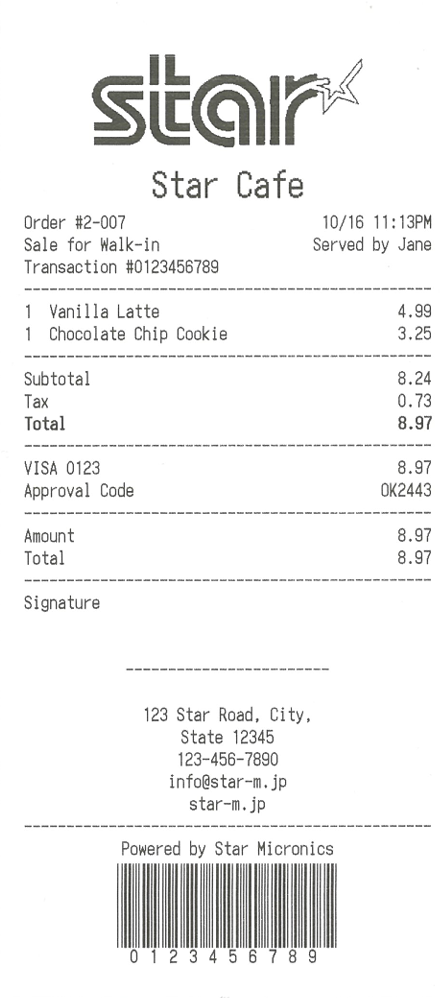
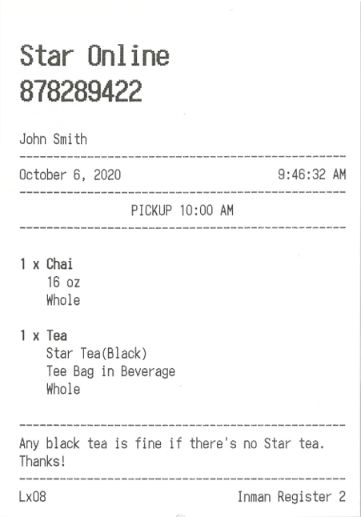
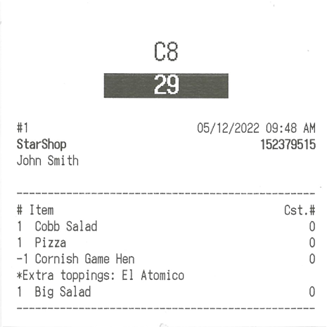
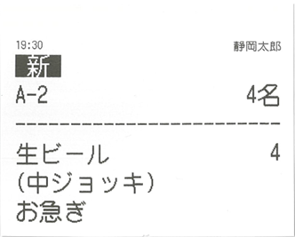

# Template Printing Samples
Please select a sample that closely resembles the layout you would like to print in your application and edit the sample data to make use of it.

## Receipt Samples
There are some samples of generating receipts using the template printing function.

Please combine ReceiptSampleXX_SampleName_TemplateData.stm as template and ReceiptSampleXX_SampleName_FieldData.json as field data.

| \# | Sample Name | Printing Result Image |
|----|-------------|-----------------------|
| 1 | Receipt (with FieldData_1.json) |  |
| 2 | Online Order |  |
| 3 | Order1 |  |
| 4 | Order2 |  |
